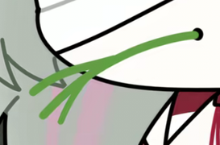

# 最短短链候选

目标: https://woshiyigemanhuajia.github.io/hunan-tariff-site/nav.html

| 服务 | 结果 |
|---|---|
| 1pt.co/t | `<!DOCTYPE html>
<html>
  <head>
    <meta charset="UTF-8" />
    <meta name="viewport" content="width=device-width, initial-scale=1.0" />
    <meta http-equiv="X-UA-Compatible" content="ie=edge" />

    <meta property="og:title" content="1 Point URL Shortener" />
    <meta property="og:type" content="website" />
    <meta property="og:url" content="https://1pt.co" />
    <meta
      property="og:image"
      content="https://1pt.co/resources/assets/og-image.png"
    />
    <meta
      property="og:description"
      content="Suspicious of this link? Use info.1pt.co to check where it leads to."
    />

    <meta http-equiv="Status" content="302 Found" />
    <title>1 Point</title>

    
    <link href="/resources/css/redirect.css" rel="stylesheet" />

    <link rel="apple-touch-icon" sizes="180x180" href="/resources/favicon/apple-touch-icon.png?v=2">
<link rel="icon" type="image/png" sizes="32x32" href="/resources/favicon/favicon-32x32.png?v=2">
<link rel="icon" type="image/png" sizes="16x16" href="/resources/favicon/favicon-16x16.png?v=2">
<link rel="manifest" href="/resources/favicon/site.webmanifest?v=2">
<link rel="mask-icon" href="/resources/favicon/safari-pinned-tab.svg?v=2" color="#2e2f4a">
<link rel="shortcut icon" href="/resources/favicon/favicon.ico?v=2">
<meta name="apple-mobile-web-app-title" content="1 Point">
<meta name="application-name" content="1 Point">
<meta name="msapplication-TileColor" content="#2e2f4a">
<meta name="msapplication-config" content="/resources/favicon/browserconfig.xml?v=2">
<meta name="theme-color" content="#2e2f4a">

  </head>

  <body>
    

      

      
Redirecting...

    

    

      <h1>Error 404</h1>
      
That page doesn't exist

       
      <a href="https://1pt.co">Back to home</a>
    

  </body>
</html>
` |
| 1pt.co/hn | `<!DOCTYPE html>
<html>
  <head>
    <meta charset="UTF-8" />
    <meta name="viewport" content="width=device-width, initial-scale=1.0" />
    <meta http-equiv="X-UA-Compatible" content="ie=edge" />

    <meta property="og:title" content="1 Point URL Shortener" />
    <meta property="og:type" content="website" />
    <meta property="og:url" content="https://1pt.co" />
    <meta
      property="og:image"
      content="https://1pt.co/resources/assets/og-image.png"
    />
    <meta
      property="og:description"
      content="Suspicious of this link? Use info.1pt.co to check where it leads to."
    />

    <meta http-equiv="Status" content="302 Found" />
    <title>1 Point</title>

    
    <link href="/resources/css/redirect.css" rel="stylesheet" />

    <link rel="apple-touch-icon" sizes="180x180" href="/resources/favicon/apple-touch-icon.png?v=2">
<link rel="icon" type="image/png" sizes="32x32" href="/resources/favicon/favicon-32x32.png?v=2">
<link rel="icon" type="image/png" sizes="16x16" href="/resources/favicon/favicon-16x16.png?v=2">
<link rel="manifest" href="/resources/favicon/site.webmanifest?v=2">
<link rel="mask-icon" href="/resources/favicon/safari-pinned-tab.svg?v=2" color="#2e2f4a">
<link rel="shortcut icon" href="/resources/favicon/favicon.ico?v=2">
<meta name="apple-mobile-web-app-title" content="1 Point">
<meta name="application-name" content="1 Point">
<meta name="msapplication-TileColor" content="#2e2f4a">
<meta name="msapplication-config" content="/resources/favicon/browserconfig.xml?v=2">
<meta name="theme-color" content="#2e2f4a">

  </head>

  <body>
    

      

      
Redirecting...

    

    

      <h1>Error 404</h1>
      
That page doesn't exist

       
      <a href="https://1pt.co">Back to home</a>
    

  </body>
</html>
` |
| 1pt.co/tf | `<!DOCTYPE html>
<html>
  <head>
    <meta charset="UTF-8" />
    <meta name="viewport" content="width=device-width, initial-scale=1.0" />
    <meta http-equiv="X-UA-Compatible" content="ie=edge" />

    <meta property="og:title" content="1 Point URL Shortener" />
    <meta property="og:type" content="website" />
    <meta property="og:url" content="https://1pt.co" />
    <meta
      property="og:image"
      content="https://1pt.co/resources/assets/og-image.png"
    />
    <meta
      property="og:description"
      content="Suspicious of this link? Use info.1pt.co to check where it leads to."
    />

    <meta http-equiv="Status" content="302 Found" />
    <title>1 Point</title>

    
    <link href="/resources/css/redirect.css" rel="stylesheet" />

    <link rel="apple-touch-icon" sizes="180x180" href="/resources/favicon/apple-touch-icon.png?v=2">
<link rel="icon" type="image/png" sizes="32x32" href="/resources/favicon/favicon-32x32.png?v=2">
<link rel="icon" type="image/png" sizes="16x16" href="/resources/favicon/favicon-16x16.png?v=2">
<link rel="manifest" href="/resources/favicon/site.webmanifest?v=2">
<link rel="mask-icon" href="/resources/favicon/safari-pinned-tab.svg?v=2" color="#2e2f4a">
<link rel="shortcut icon" href="/resources/favicon/favicon.ico?v=2">
<meta name="apple-mobile-web-app-title" content="1 Point">
<meta name="application-name" content="1 Point">
<meta name="msapplication-TileColor" content="#2e2f4a">
<meta name="msapplication-config" content="/resources/favicon/browserconfig.xml?v=2">
<meta name="theme-color" content="#2e2f4a">

  </head>

  <body>
    

      

      
Redirecting...

    

    

      <h1>Error 404</h1>
      
That page doesn't exist

       
      <a href="https://1pt.co">Back to home</a>
    

  </body>
</html>
` |
| 1pt.co/zf | `<!DOCTYPE html>
<html>
  <head>
    <meta charset="UTF-8" />
    <meta name="viewport" content="width=device-width, initial-scale=1.0" />
    <meta http-equiv="X-UA-Compatible" content="ie=edge" />

    <meta property="og:title" content="1 Point URL Shortener" />
    <meta property="og:type" content="website" />
    <meta property="og:url" content="https://1pt.co" />
    <meta
      property="og:image"
      content="https://1pt.co/resources/assets/og-image.png"
    />
    <meta
      property="og:description"
      content="Suspicious of this link? Use info.1pt.co to check where it leads to."
    />

    <meta http-equiv="Status" content="302 Found" />
    <title>1 Point</title>

    
    <link href="/resources/css/redirect.css" rel="stylesheet" />

    <link rel="apple-touch-icon" sizes="180x180" href="/resources/favicon/apple-touch-icon.png?v=2">
<link rel="icon" type="image/png" sizes="32x32" href="/resources/favicon/favicon-32x32.png?v=2">
<link rel="icon" type="image/png" sizes="16x16" href="/resources/favicon/favicon-16x16.png?v=2">
<link rel="manifest" href="/resources/favicon/site.webmanifest?v=2">
<link rel="mask-icon" href="/resources/favicon/safari-pinned-tab.svg?v=2" color="#2e2f4a">
<link rel="shortcut icon" href="/resources/favicon/favicon.ico?v=2">
<meta name="apple-mobile-web-app-title" content="1 Point">
<meta name="application-name" content="1 Point">
<meta name="msapplication-TileColor" content="#2e2f4a">
<meta name="msapplication-config" content="/resources/favicon/browserconfig.xml?v=2">
<meta name="theme-color" content="#2e2f4a">

  </head>

  <body>
    

      

      
Redirecting...

    

    

      <h1>Error 404</h1>
      
That page doesn't exist

       
      <a href="https://1pt.co">Back to home</a>
    

  </body>
</html>
` |
| 1pt.co/hntf | `<!DOCTYPE html>
<html>
  <head>
    <meta charset="UTF-8" />
    <meta name="viewport" content="width=device-width, initial-scale=1.0" />
    <meta http-equiv="X-UA-Compatible" content="ie=edge" />

    <meta property="og:title" content="1 Point URL Shortener" />
    <meta property="og:type" content="website" />
    <meta property="og:url" content="https://1pt.co" />
    <meta
      property="og:image"
      content="https://1pt.co/resources/assets/og-image.png"
    />
    <meta
      property="og:description"
      content="Suspicious of this link? Use info.1pt.co to check where it leads to."
    />

    <meta http-equiv="Status" content="302 Found" />
    <title>1 Point</title>

    
    <link href="/resources/css/redirect.css" rel="stylesheet" />

    <link rel="apple-touch-icon" sizes="180x180" href="/resources/favicon/apple-touch-icon.png?v=2">
<link rel="icon" type="image/png" sizes="32x32" href="/resources/favicon/favicon-32x32.png?v=2">
<link rel="icon" type="image/png" sizes="16x16" href="/resources/favicon/favicon-16x16.png?v=2">
<link rel="manifest" href="/resources/favicon/site.webmanifest?v=2">
<link rel="mask-icon" href="/resources/favicon/safari-pinned-tab.svg?v=2" color="#2e2f4a">
<link rel="shortcut icon" href="/resources/favicon/favicon.ico?v=2">
<meta name="apple-mobile-web-app-title" content="1 Point">
<meta name="application-name" content="1 Point">
<meta name="msapplication-TileColor" content="#2e2f4a">
<meta name="msapplication-config" content="/resources/favicon/browserconfig.xml?v=2">
<meta name="theme-color" content="#2e2f4a">

  </head>

  <body>
    

      

      
Redirecting...

    

    

      <h1>Error 404</h1>
      
That page doesn't exist

       
      <a href="https://1pt.co">Back to home</a>
    

  </body>
</html>
` |
| tny.im/hn | `<!DOCTYPE html>
<html>

<head>
    <meta charset='utf-8'>
    <meta http-equiv='X-UA-Compatible' content='IE=edge'>
    <title>tny.im</title>
    <meta name='viewport' content='width=device-width, initial-scale=1'>
</head>

<body>
    
    

        

        

        

    

    

        
        
For any inquiries, reach out to <a href="https://gbl08ma.com" target="_blank"
                rel="noopener">gbl08ma</a>.
        

    

    
<!-- Cloudflare Pages Analytics --><!-- Cloudflare Pages Analytics --></body>

</html>` |
| tny.im/tf | `<!DOCTYPE html>
<html>

<head>
    <meta charset='utf-8'>
    <meta http-equiv='X-UA-Compatible' content='IE=edge'>
    <title>tny.im</title>
    <meta name='viewport' content='width=device-width, initial-scale=1'>
</head>

<body>
    
    

        

        

        

    

    

        
        
For any inquiries, reach out to <a href="https://gbl08ma.com" target="_blank"
                rel="noopener">gbl08ma</a>.
        

    

    
<!-- Cloudflare Pages Analytics --><!-- Cloudflare Pages Analytics --></body>

</html>` |
| tny.im/hntf | `<!DOCTYPE html>
<html>

<head>
    <meta charset='utf-8'>
    <meta http-equiv='X-UA-Compatible' content='IE=edge'>
    <title>tny.im</title>
    <meta name='viewport' content='width=device-width, initial-scale=1'>
</head>

<body>
    
    

        

        

        

    

    

        
        
For any inquiries, reach out to <a href="https://gbl08ma.com" target="_blank"
                rel="noopener">gbl08ma</a>.
        

    

    
<!-- Cloudflare Pages Analytics --><!-- Cloudflare Pages Analytics --></body>

</html>` |
| da.gd | `https://da.gd/fS6VH` |
| t.ly | `{
    "message": "Invalid request please contact support@t.ly"
}` |
| shorturl.at | `` |
| is.gd/hntf 重试 | `Error, database insert failed` |
| is.gd 随机 | `Error, database insert failed` |
